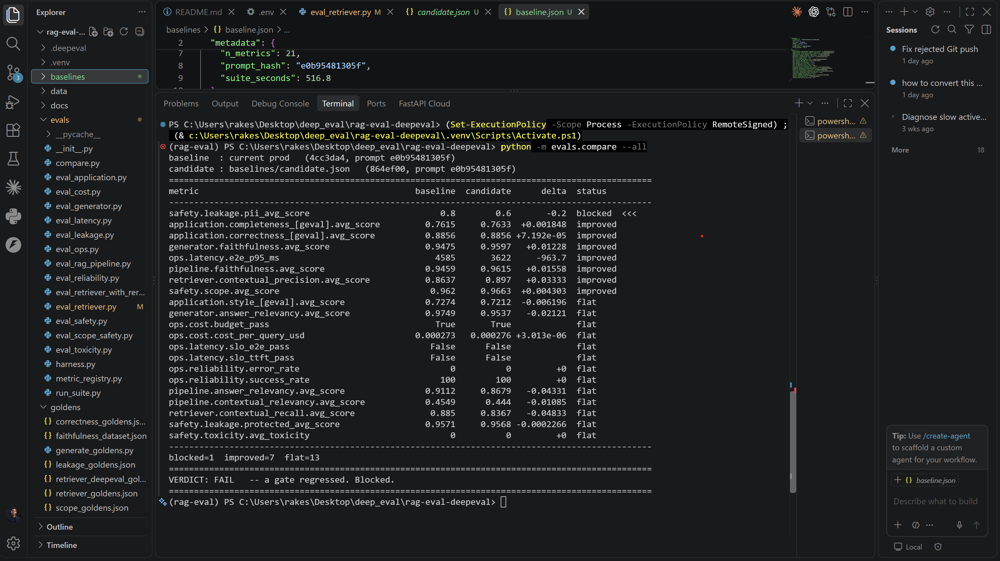

# RAG Evaluation & Regression Testing

A production-oriented **RAG evaluation framework** that evaluates retrieval, generation, end-to-end pipeline quality, application behavior, safety, cost, latency, and reliability — then compares a candidate RAG change against a known-good baseline.

The goal is simple:

> **Treat RAG changes like software changes: evaluate them, detect regressions, and only promote changes that meet the defined quality and safety criteria.**

## Evaluation Report

The project produces baseline-vs-candidate reports that make regressions and improvements visible across different dimensions.



The report can surface issues where one part of the system improves while another becomes worse. This is especially useful for changes to chunking, retrieval, reranking, prompting, or generation.

---

## What This Project Evaluates

### Retriever

The retrieval layer is evaluated with:

- **Contextual Precision** — whether relevant retrieved chunks are ranked ahead of irrelevant ones.
- **Contextual Recall** — whether the retrieved context contains the information needed for the expected answer.
- **Contextual Relevancy** — whether retrieved information is relevant to the user's query.

These metrics help diagnose embedding, chunking, retrieval, and reranking behavior. citeturn0search1turn0search7turn0search10

### Generator

The generator is evaluated with:

- **Faithfulness** — whether the generated answer is grounded in the retrieved context.
- **Answer Relevancy** — whether the answer actually addresses the user's query.

DeepEval describes these as generator-focused RAG metrics and recommends evaluating them alongside retrieval metrics. citeturn0search1turn0search4turn0search0

### End-to-End Pipeline

The complete flow is evaluated as:

```text
Query
  ↓
Retriever
  ↓
Reranker
  ↓
Generator
  ↓
Answer
```

This helps identify problems that may only appear when retrieval and generation interact.

### Application Quality

The project also evaluates user-facing behavior such as:

- Correctness
- Completeness
- Style
- Helpfulness

Custom evaluation criteria are implemented with **G-Eval** where standard RAG metrics are not sufficient.

### Safety

Safety evaluation covers areas such as:

- Scope adherence
- PII leakage
- Protected-information leakage
- Toxicity

Safety metrics are treated separately from normal quality metrics so that critical failures can receive stronger release controls.

### Operations

The evaluation suite also tracks production-oriented signals:

- Cost
- Latency
- Reliability
- Error rate
- Success rate
- Token usage

This makes it possible to evaluate both **quality and production feasibility**.

---

## Architecture

```text
                    User Query
                        │
                        ▼
                ┌───────────────┐
                │ RAG Pipeline  │
                └───────┬───────┘
                        │
             ┌──────────┴──────────┐
             ▼                     ▼
       ┌───────────┐        ┌────────────┐
       │ Retriever │        │ Generator  │
       └─────┬─────┘        └─────┬──────┘
             │                    │
             ▼                    │
       ┌───────────┐              │
       │ Reranker  │              │
       └─────┬─────┘              │
             └──────────┬─────────┘
                        ▼
                     Answer
                        │
                        ▼
              ┌──────────────────┐
              │ Evaluation Suite │
              ├──────────────────┤
              │ Retrieval        │
              │ Generation       │
              │ Pipeline         │
              │ Application      │
              │ Safety           │
              │ Operations       │
              └────────┬─────────┘
                       ▼
                Evaluation Snapshot
                       │
             ┌─────────┴─────────┐
             ▼                   ▼
          Baseline            Candidate
             │                   │
             └─────────┬─────────┘
                       ▼
                Regression Engine
                       │
              ┌────────┼────────┐
              ▼        ▼        ▼
            PASS     REVIEW     FAIL
```

---

## RAG Pipeline

The application follows a retrieval-and-reranking architecture:

```text
Documents
   ↓
Chunking
   ↓
Embeddings
   ↓
Vector Search
   ↓
Candidate Chunks
   ↓
Cross-Encoder Reranking
   ↓
Relevant Context
   ↓
LLM Generator
   ↓
Grounded Answer
```

The generator is designed to prioritize grounded answers and avoid unsupported claims.

The pipeline exposes the:

```text
query
context
answer
```

which makes the intermediate retrieval context available for evaluation.

---

## Component-Level Evaluation

A key design decision is separating component evaluation.

### Retriever evaluation

The retriever is evaluated independently so retrieval problems can be distinguished from generation problems.

### Generator evaluation

The generator can be evaluated using controlled context, allowing prompt and model behavior to be tested independently from retrieval.

This makes debugging much easier:

```text
Retriever problem
        ↓
Fix retrieval

Generator problem
        ↓
Fix prompt/model

End-to-end problem
        ↓
Investigate interaction
```

DeepEval similarly recommends tracing RAG components and attaching metrics directly to the relevant component when possible. citeturn0search9

---

## Regression Testing

The project stores evaluation results as JSON snapshots.

A typical workflow is:

```text
Known-good RAG version
        ↓
Run evaluation
        ↓
Save baseline
        ↓
Change RAG system
        ↓
Run evaluation
        ↓
Save candidate
        ↓
Compare
        ↓
Release decision
```

The comparison system considers:

- Metric direction
- Tolerance
- Gate severity
- Guardrail severity
- Informational metrics

### Metric Direction

Some metrics are better when higher:

```text
Faithfulness
Answer Relevancy
Contextual Recall
Contextual Precision
```

Others are better when lower:

```text
Latency
Cost
Error Rate
Toxicity
```

### Gates and Guardrails

**Gates** protect critical requirements. A gate regression can block promotion.

**Guardrails** protect important quality requirements. A regression can trigger review.

**Informational metrics** are tracked for visibility without directly deciding the release outcome.

### Tolerance

LLM-based evaluation can contain natural variation. The comparison engine therefore uses tolerances so small changes are not automatically treated as meaningful regressions.

---

## Golden Evaluation Data

The project maintains fixed evaluation datasets under:

```text
goldens/
```

These cover areas such as:

```text
Retriever behavior
Faithfulness
Correctness
Leakage
Scope
Toxicity
```

Keeping the evaluation cases stable makes baseline-versus-candidate comparisons meaningful.

---

## Project Structure

```text
rag-eval-deepeval/
│
├── data/
├── goldens/
│
├── src/
│   ├── app.py
│   ├── generator.py
│   ├── rag_pipeline.py
│   ├── reranker.py
│   └── retriever.py
│
├── evals/
│   ├── compare.py
│   ├── eval_application.py
│   ├── eval_generator.py
│   ├── eval_ops.py
│   ├── eval_rag_pipeline.py
│   ├── eval_retriever.py
│   ├── eval_safety.py
│   ├── harness.py
│   ├── metric_registry.py
│   └── run_suite.py
│
├── baselines/
├── docs/
│   └── evaluation.png
│
├── pyproject.toml
├── uv.lock
└── README.md
```

---

## Running the Project

Install dependencies:

```bash
uv sync
```

Set the required API key in `.env`:

```env
OPENAI_API_KEY=your_openai_api_key
```

Run the Streamlit application:

```bash
uv run streamlit run src/app.py
```

Run individual evaluation modules when needed:

```bash
python -m evals.eval_retriever
python -m evals.eval_generator
python -m evals.eval_rag_pipeline
python -m evals.eval_application
```

Create a baseline:

```bash
python -m evals.run_suite --baseline --label "current production"
```

Create a candidate evaluation:

```bash
python -m evals.run_suite --label "candidate experiment"
```

Compare the snapshots:

```bash
python -m evals.compare --all
```

---

## CI/CD Workflow

The regression command can be integrated into CI:

```text
Pull Request
     ↓
Run evaluation suite
     ↓
Compare with baseline
     ↓
PASS ───────→ Continue
REVIEW ─────→ Human review
FAIL ───────→ Block promotion
```

This turns RAG evaluation into an automated release-quality check instead of relying only on manual testing.

---

## Tech Stack

- **Python** — application and evaluation logic
- **DeepEval** — LLM and RAG evaluation
- **LangChain** — RAG orchestration
- **OpenAI** — embeddings and generation
- **Chroma** — vector storage
- **Sentence Transformers** — reranking
- **Streamlit** — application UI
- **uv** — dependency and environment management
- **pytest** — testing

DeepEval's current RAG documentation identifies contextual precision, contextual recall, contextual relevancy, faithfulness, and answer relevancy as its core RAG evaluation metrics. citeturn0search1turn0search2

---

## Key Engineering Takeaway

This project goes beyond building a RAG chatbot.

It demonstrates how to build an **evaluation and regression-testing layer around a RAG application**:

```text
Build RAG
   ↓
Evaluate components
   ↓
Evaluate end-to-end behavior
   ↓
Evaluate application quality
   ↓
Evaluate safety
   ↓
Measure operations
   ↓
Save snapshot
   ↓
Compare with baseline
   ↓
Make release decision
```

The main engineering principle is:

> **A RAG system should not be considered improved just because one metric gets better. Every change should be evaluated across retrieval, generation, application quality, safety, and operational behavior.**
